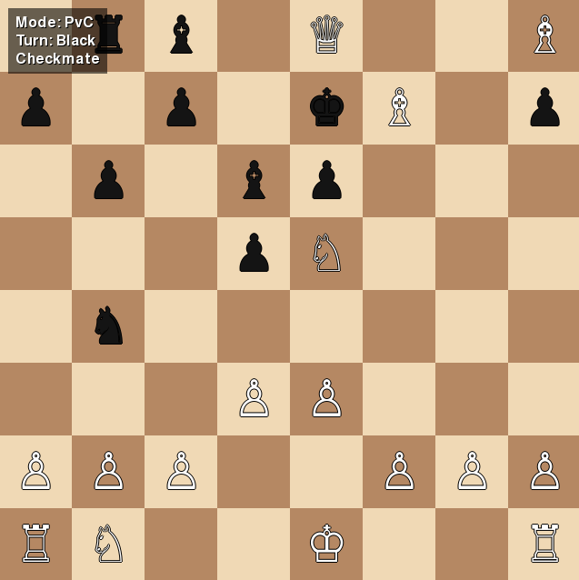

# Simple Chess Python

`simple-chess-python` é um jogo de xadrez desenvolvido em Python, com execução local, interface gráfica em Pygame, modo PvP local e modo PvC contra uma IA simples baseada em movimentos legais aleatórios.

O projeto foi criado com o intuito de servir como um experimento prático de desenvolvimento assistido por IA. Ele testa um fluxo próprio de implementação apoiado por automação no n8n, documentação estruturada, issues formais, validação incremental e passagens estruturadas de contexto para ferramentas de IA.

---

## Imagem do tabuleiro



---

## Como o projeto foi implementado

A implementação foi conduzida de forma incremental, usando uma abordagem próxima de práticas conhecidas como:

- **spec-driven development**, porque as funcionalidades foram derivadas de documentos de visão, arquitetura e planejamento;
- **issue-driven development**, porque cada parte relevante do projeto foi implementada a partir de issues específicas;
- **docs-as-code**, porque a documentação do projeto é versionada junto com o código;
- **human-in-the-loop**, porque o usuário revisa decisões, aprova mudanças e controla o avanço entre etapas;
- **incremental delivery**, porque cada milestone entrega uma capacidade verificável antes da próxima evolução.

Na prática, o fluxo usado foi:

```text
visão do projeto
→ arquitetura
→ milestones
→ issues formais
→ implementação assistida por IA
→ testes e validação
→ commit
→ próxima issue ou próxima milestone
```

O n8n foi usado como orquestrador externo desse processo. Ele não faz parte do runtime do jogo e não é necessário para jogar. O papel do n8n é apoiar o fluxo de desenvolvimento: preparar contexto, organizar artefatos, acionar etapas, registrar evidências e ajudar a manter rastreabilidade.

O GitHub foi usado como ponto de consulta humana para as issues e para o histórico do projeto, enquanto o código-fonte permanece como a fonte técnica principal da implementação.

---

## Links das issues e milestones

- Issues: [Issues do projeto](https://github.com/FabioAguiar/simple-chess-python/issues)
- Milestones: [Milestones do projeto](https://github.com/FabioAguiar/simple-chess-python/milestones)

### Issues por milestone

- M1 — Fundação documental
- [M2 — Estrutura base Python e organização modular](https://github.com/FabioAguiar/simple-chess-python/milestone/76)
- [M3 — Domínio e regras do xadrez](https://github.com/FabioAguiar/simple-chess-python/milestone/77)
- [M4 — Aplicação, sessão de partida e modos de jogo](https://github.com/FabioAguiar/simple-chess-python/milestone/79)
- [M5 — Interface local inicial com Pygame](https://github.com/FabioAguiar/simple-chess-python/milestone/80)
- [M6 — Modo PvP local jogável](https://github.com/FabioAguiar/simple-chess-python/milestone/81)
- [M7 — IA aleatória isolada](https://github.com/FabioAguiar/simple-chess-python/milestone/82)
- [M8 — Modo PvC local](https://github.com/FabioAguiar/simple-chess-python/milestone/83)
- [M9 — Testes, validação e aderência arquitetural](https://github.com/FabioAguiar/simple-chess-python/milestone/84)


---

## Funcionalidades do jogo

O projeto tem como núcleo uma versão simples e local de xadrez com:

- tabuleiro de xadrez renderizado em Pygame;
- peças exibidas visualmente no tabuleiro;
- interação por mouse;
- modo PvP local;
- modo PvC local;
- IA simples que escolhe movimentos legais aleatórios;
- controle de turno;
- aplicação de movimentos válidos;
- rejeição de movimentos inválidos;
- atualização visual após movimentos e capturas;
- testes automatizados para domínio, aplicação, IA e fluxos principais.

---

## Fora de escopo da versão inicial

A versão inicial evita intencionalmente funcionalidades mais avançadas, como:

- multiplayer online;
- aplicação web;
- banco de dados obrigatório;
- engine competitiva de xadrez;
- integração com Stockfish;
- IA avançada;
- autenticação de usuários;
- ranking ou matchmaking;
- salvamento/carregamento complexo de partidas;
- integração direta com IA externa para análise de partidas.

Essas limitações ajudam a manter o projeto pequeno e adequado ao objetivo principal: testar um fluxo incremental de implementação com apoio de IA.

---

## Arquitetura em alto nível

O projeto segue uma arquitetura modular simples em camadas leves:

```text
ui → app → domain → python-chess
        ↘ ai
```

As responsabilidades principais são:

- `domain`: encapsula regras e estado do xadrez, usando a biblioteca `python-chess`;
- `app`: coordena sessão, turno, modos de jogo e fluxo da partida;
- `ai`: contém a estratégia simples da IA;
- `ui`: renderiza a interface local com Pygame e captura interações do usuário.

A interface não deve validar regras de xadrez diretamente. A IA não deve alterar o estado da partida diretamente. O domínio deve preservar a responsabilidade sobre regras, movimentos legais e estado central da partida.

---

## Tecnologias utilizadas

- Python
- Pygame
- python-chess
- pytest
- Ruff
- n8n como orquestrador externo do fluxo de desenvolvimento
- GitHub como repositório e referência de issues
- IA assistiva para implementação incremental

---

## Como preparar o ambiente

A recomendação atual é usar Python 3.12, principalmente por compatibilidade com Pygame. Os comandos abaixo devem ser executados a partir da raiz do repositório `simple-chess-python`.

```bash
conda create -n chess python=3.12 -y
conda activate chess
conda install -c conda-forge pygame -y
python -m pip install --upgrade pip
python -m pip install -e .
python -m pip install pytest ruff pytest-cov
```

---

## Como abrir o jogo

Após preparar o ambiente, execute:

```bash
conda activate chess
python -c "from simple_chess.ui import run; run()"
```

Uma melhoria futura pode adicionar um entrypoint oficial, como:

```bash
python -m simple_chess
```

ou um comando instalado, como:

```bash
simple-chess
```

---

## Como rodar os testes

Para executar todos os testes:

```bash
python -m pytest -q
```

Para listar os testes coletados sem executá-los:

```bash
python -m pytest --collect-only -q
```

Para rodar lint com Ruff:

```bash
python -m ruff check .
```

---

## Status do experimento

Este projeto representa uma primeira validação prática de um fluxo de desenvolvimento assistido por IA e orquestrado com n8n.

Além do jogo em si, o resultado esperado é gerar aprendizado sobre:

- qualidade de prompts;
- granularidade ideal de issues;
- limites entre documentação, implementação e validação;
- uso de IA em tarefas incrementais;
- automação de etapas repetitivas;
- pontos em que a intervenção humana ainda é necessária;
- formas de melhorar o pipeline para projetos futuros.

Além de funcionar como um jogo de xadrez, este projeto também registra um experimento prático de construção de software com apoio de IA, automação e documentação estruturada.

---

## Autoavaliação técnica

Antes do início da implementação, foi decidido arquiteturalmente o uso da biblioteca `python-chess` como fonte principal para regras, estado da partida, movimentos legais, aplicação de jogadas e detecção de estados do jogo. Essa decisão foi tomada para evitar a implementação manual das regras completas do xadrez e para manter a biblioteca encapsulada na camada de domínio, conforme a separação planejada entre domínio, aplicação, IA e interface.

Apesar dessa decisão arquitetural prévia, a implementação assistida por IA manteve algumas validações auxiliares na camada de aplicação, especialmente relacionadas à compatibilidade entre a peça selecionada e o turno atual. Essas validações não substituem o `python-chess`, mas criam uma camada defensiva adicional antes da validação real feita pelo domínio.

Do ponto de vista funcional, essa redundância não impede o funcionamento do jogo. No entanto, do ponto de vista de qualidade de código, ela representa um ponto de melhoria: parte dessas verificações poderia ser simplificada ou removida, deixando o `python-chess` como autoridade única para decidir se uma jogada é legal ou ilegal.

Um exemplo disso é a validação manual de que a peça de origem pertence ao jogador da vez. Embora essa checagem possa ajudar no fluxo da aplicação e no feedback inicial ao usuário, o próprio `python-chess` já rejeitaria movimentos incompatíveis com o turno atual ao consultar os movimentos legais disponíveis.

Como melhoria futura, o projeto pode:

- reduzir validações manuais que duplicam decisões já cobertas por `python-chess`;
- manter na camada de aplicação apenas validações de fluxo, modo de jogo e interação do usuário;
- concentrar a legalidade dos movimentos no domínio;
- revisar nomes de métodos para diferenciar melhor validação de regra de xadrez e validação de fluxo da aplicação;
- simplificar o processamento de jogadas usando um método único de tentativa de aplicação, como `try_push_uci`.

Essa observação não invalida a implementação atual. Pelo contrário, ela registra um aprendizado importante do experimento: mesmo com documentação, issues formais e validação incremental, a implementação assistida por IA pode introduzir camadas defensivas ou redundantes. Identificar e documentar essas ocorrências faz parte do objetivo do projeto como estudo prático de desenvolvimento incremental com apoio de IA.

---

## Licença

Este projeto está licenciado sob os termos da MIT License.